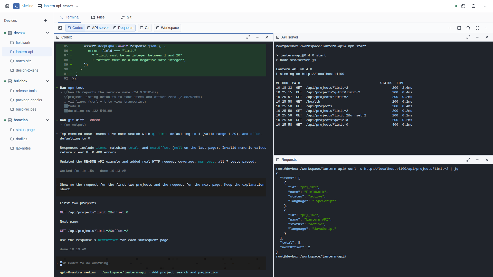
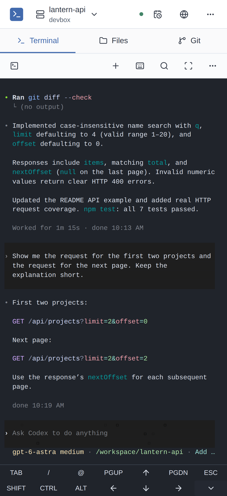
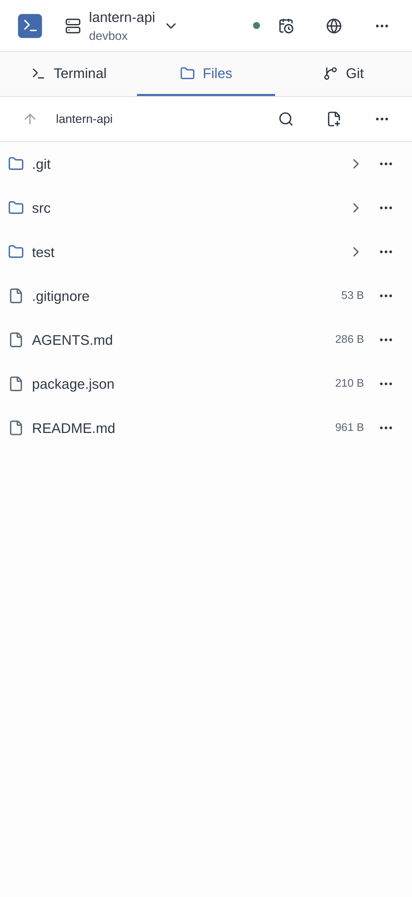
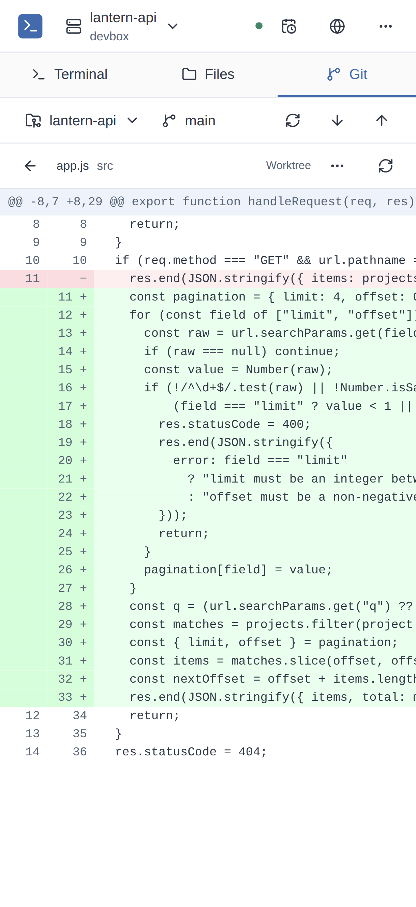

# Kiteline

[English](README.en.md)

Kiteline 是一个自托管的 coding agent 工作台。Claude Code、Codex 等任意命令行工具以原生 TUI 运行在你自己的设备上，通过浏览器即可管理多台设备和项目；同一个终端会话可在电脑与手机之间无缝流转。

<p align="center">
  <a href="docs/assets/readme-desktop.png"></a>
</p>

<p align="center">
  <a href="docs/assets/readme-mobile-terminal.png"></a>
  <a href="docs/assets/readme-mobile-files.png"></a>
  <a href="docs/assets/readme-mobile-git.png"></a>
</p>

- **原生 TUI**：agent 运行在真实终端中，保留其原有界面与交互，任何命令行工具无需适配即可使用。
- **多端无缝流转**：同一个终端会话可同时在电脑、手机和设备本机终端中打开，输出实时同步，切换设备时任务不中断。
- **多设备与工作区**：接入 Linux、Windows 和 macOS 设备，按项目切换工作区，沿用各设备已有的工具链与环境。
- **终端、文件与 Git**：终端支持分组和分屏；查看代码改动、编辑文件时，agent 会话保持运行。
- **开发预览**：在浏览器中直接访问设备上运行的 Web 服务，支持 WebSocket 与热更新。
- **定时任务**：按 cron 计划在设备上运行脚本或 agent，并保留运行记录；agent 也可自行创建任务。

## 开始使用

Kiteline 面向个人使用。准备一台安装了 Docker 的 Linux 主机部署 server；开发设备需安装 Git 2.23+、所需 Shell，以及已登录的 coding CLI。[系统要求](docs/guide/devices.md#支持的系统与准备)

```sh
mkdir kiteline && cd kiteline
curl -fsSLO https://github.com/Azure99/kiteline/releases/latest/download/compose.yaml
docker compose up -d
docker compose logs server
```

1. 打开 `http://127.0.0.1:8080`，用日志中的初始化 token（30 分钟内有效）设置密码。默认只监听本机；连接其他设备或手机前，按[部署指南](docs/guide/server.md)配置可达地址和 HTTPS。
2. 从“绑定设备”获取安装命令，在开发设备上以日常账户执行。浏览器和设备都需能访问生成命令时使用的 server 地址。
3. 添加项目目录为工作区，打开终端启动 coding CLI。其他设备和项目同样接入。

安装命令会在前台运行 agent；长期使用按[设备指南](docs/guide/devices.md#后台运行)配置后台服务。登录者拥有 agent 运行账户的文件和命令权限。

## 文档

[工作台使用](docs/guide/usage.md) · [设备维护](docs/guide/devices.md) · [定时任务](docs/guide/scheduled-tasks.md) · [命令与配置](docs/guide/reference.md) · [开发文档](docs/README.md)

## 许可证

[Apache-2.0](LICENSE)。第三方组件的许可与来源见[产物结构](docs/development/release.md#产物结构)。
