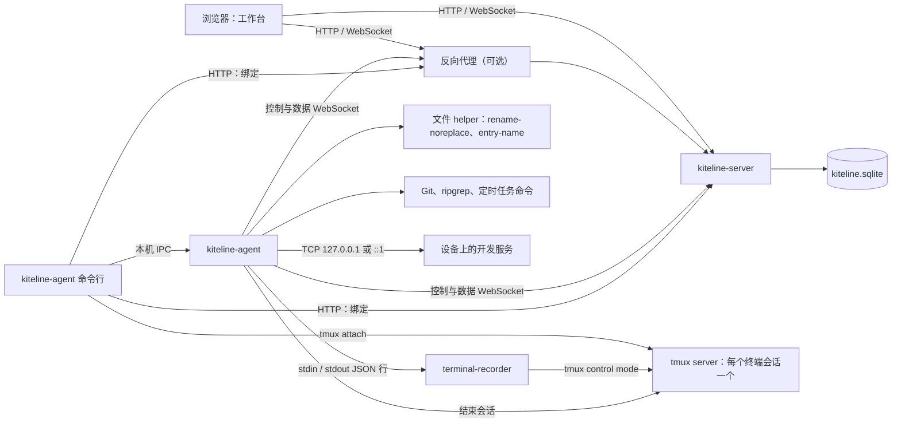

# 架构

本文帮助贡献者和 coding agent 在改代码前了解 Kiteline 的整体结构。进程之间的接口见[通信契约](protocol.md)，各工具的机制见同目录的其他文档。

## 组成



箭头表示连接的发起方向，连接建立后双向传输数据。

- **server**（`kiteline-server`）：运行在 Linux 上的一个 Node 进程，提供工作台静态文件、`/api/` 接口、浏览器和 agent 的 WebSocket 连接、开发服务代理（`/proxy/`、`/absproxy/`）和 agent 安装资源。server 只监听 HTTP，HTTPS 由反向代理提供。管理数据保存在 server 数据目录的 `kiteline.sqlite` 中。
- **工作台**：server 提供的单页应用。浏览器只与 server 同源通信，从不直接连接设备。
- **agent**（`kiteline-agent run`）：每台设备一个 Node 进程，以项目用户身份运行。agent 主动连接 server：一条控制 WebSocket 承载 RPC 和事件，每次文件读写、终端附着和开发服务请求另开一条数据 WebSocket。agent 不监听 TCP 端口；同一用户的本机命令行通过[本机 IPC](protocol.md#本机-ipc) 访问它。
- **recorder**（`terminal-recorder`）：agent 在第一次需要时启动的 Node 子进程，每个 agent 最多一个，通过 stdin 和 stdout 与 agent 通信。它为每个终端会话运行一个 tmux control 客户端，把输出写入 `@xterm/headless` 屏幕模型，浏览器附着时从这个模型恢复画面。
- **tmux server**：每个终端会话一个私有 tmux server，socket 为 `<运行目录>/<sessionId>/tmux.sock`，会话名固定为 `kiteline`（`shared/src/terminal/node.ts` 的 `tmuxSession`）。终端程序运行在其中，浏览器断开或 recorder 退出都不会结束它；`kiteline-agent attach` 直接附着到这个 socket。Windows 上 tmux 运行在随包的私有 MSYS2 环境中，见[平台实现](platforms.md#windows)。
- **文件 helper**：Linux 和 macOS 上，不覆盖目标的改名由一次性进程 `rename-noreplace` 完成；macOS 另用 `entry-name` 查询目录项在磁盘上的实际名称。Windows 不使用 helper，同类能力由 agent 进程加载的原生 addon（`native/windows/`）提供。

## 仓库结构

```text
server/src/              kiteline-server
  app.ts                 HTTP 路由和 WebSocket 升级入口；路由的先后顺序决定它经过哪些检查
  http.ts                入口 origin、Cookie、Origin 检查、错误状态码、尝试次数限制
  connections.ts         agent 控制连接、浏览器事件连接、RPC 转发
  channels.ts            数据通道；file-transfer.ts 转发文件内容
  http-proxy.ts          开发服务代理；proxy-headers.ts 处理请求头
  agent-installation.ts  接入和升级脚本、agent 发布包下载
  store.ts               SQLite 存储
  main.ts                命令行：serve、setup-token、reset-password
agent/src/               kiteline-agent
  agent.ts               控制连接、RPC 分派与期限、本机 IPC 白名单
  local.ts               本机 IPC 的监听端（LocalServer）和客户端（localRequest）
  config.ts、limits.ts    目录、config.json、可调与固定限额、JSON 原子写入
  metadata.ts            工作区、快捷方式、设置
  watches.ts             活跃工作区的文件监听
  cli/、install/          命令行子命令；安装、升级、卸载
  terminal/              终端会话、recorder 进程管理、终端数据通道
  files/、git/            文件工具、Git 工具
  http/、tasks/           开发服务通道与端口建议、定时任务
terminal-recorder/src/   recorder：tmux control 客户端、屏幕模型、附着流控、输入队列
shared/src/protocol/     跨进程类型、固定限额、校验函数、WebSocket 与 stdio 辅助
shared/src/terminal/     xterm 适配、tmux 路径与启动
shared/src/windows/      Windows 原生 addon 的封装
shared/src/version.json  产品版本号
web/src/                 工作台：app.tsx、workbench.tsx 和各工具目录
  devices/               设备、绑定、工作区、事件连接
  terminal/、files/、git/、tasks/   各工具界面
  components/            通用组件；ui/ 为本地 UI 组件
  lib/                   API 客户端、版本检查、浏览器兼容、视口
  i18n/                  en、zh-CN 文案
web/postcss/             Chromium 97 的 CSS layer 适配
web/patches/             xterm.js 补丁
*/test/                  各包的测试；web/test/*.typecheck.ts 只做类型检查
native/                  helper 和 Windows addon 源码、tmux 补丁与 terminfo
installer/               接入、安装、升级脚本和 launcher；.in 文件是模板
scripts/                 构建、组包、验证和本地开发脚本
release/                 固定构建输入和 Dockerfile
deploy/                  Compose、systemd、launchd、WinSW 示例
.github/workflows/       CI 与发布
```

根目录有 `package.json`（脚本、Node 22.23.3）、`pnpm-workspace.yaml`（五个包、依赖覆盖和补丁）、`tsconfig*.json`、`eslint.config.mjs`、`vitest.config.ts` 和 `.prettierrc.json`。检查命令见[源码开发](../development/setup.md#检查与测试)，构建输入见 [release/README.md](../../release/README.md)。

`shared` 按入口导出（`@kiteline/shared/protocol`、`/protocol/ws`、`/terminal/node`、`/windows/pipe` 等）。工作台只导入不依赖 Node 的 `protocol`、`protocol/text` 和 `terminal`。

## 状态归属

| 状态                                   | 位置                              | 说明                                 |
| -------------------------------------- | --------------------------------- | ------------------------------------ |
| 拥有者密码哈希、初始化 token 摘要      | server SQLite 表 `owner`、`setup` |                                      |
| 登录会话                               | 表 `sessions`                     | 只存令牌摘要和到期时间               |
| 设备登记、令牌摘要、元数据快照         | 表 `devices`                      | 快照由 agent 报告，整份替换          |
| 绑定码摘要和绑定结果                   | 表 `bindings`                     |                                      |
| 定时任务摘要                           | 表 `taskSummaries`                | 不含命令和输出                       |
| 设备版本观察、设备环境                 | server 内存                       | 环境只在设备在线时存在               |
| 工作区、快捷方式、终端历史行数         | agent 数据目录 `agent.json`       | 写盘成功后再报告快照                 |
| 设备凭据                               | `connection.json`                 | server 地址、设备 ID、设备令牌       |
| 可调配置                               | `config.json`                     |                                      |
| 未清理的临时文件记录                   | `temporary-files.json`            | 见[文件](files.md#整理操作)          |
| 定时任务定义、运行记录、输出           | `tasks/`                          |                                      |
| 本机 IPC 端点                          | 运行目录 `agent.sock`             | Windows 用命名管道                   |
| tmux socket 和配置                     | 运行目录 `<sessionId>/`           |                                      |
| 终端会话列表                           | agent 内存                        | agent 重启后为空                     |
| 终端中运行的程序                       | tmux server                       |                                      |
| 终端输出和屏幕模型                     | recorder 内存                     | 见[终端](terminal.md#输出记录与历史) |
| 最近工作区、终端字号、界面语言         | 浏览器 `localStorage`             | 按 origin（含端口）分别保存          |
| 当前设备、工作区、工具和打开的目标     | 页面 URL                          | 可刷新、收藏和前进后退               |
| 草稿、终端布局、上传列表、Git 操作状态 | 浏览器页面内存                    | 刷新或关闭页面后丢失                 |
| 登录状态                               | 浏览器 Cookie                     |                                      |

定时任务摘要的字段见 [server 摘要](scheduled-tasks.md#server-摘要)，登录 Cookie 的规则见[请求入口与认证](protocol.md#请求入口与认证)。

`localStorage` 的键：

- `kiteline.language`：手动选择的语言；选择“跟随浏览器”时删除该键。
- `kiteline.recentWorkspaces`：最近工作区及上次使用的工具，最多 8 项。
- `kiteline.terminal-font-size`：终端字号。

目录的默认位置见[文件位置](../guide/reference.md#文件位置)。

server 不保存文件内容、diff、终端输出、定时任务的命令和输出。这些内容在 agent 与浏览器之间经过 server 转发，只停留在内存中的固定大小队列里（见[数据通道](protocol.md#数据通道)）。

agent 的 JSON 状态文件以原子替换写入，不调用 fsync，见[目录与权限](agent-lifecycle.md#目录与权限)。`agent.json` 不是合法 JSON 时，agent 启动失败并保留原文件。

## 请求流程

### RPC

1. 工作台的 `rpc()`（`web/src/lib/api.ts`）生成请求 ID，发送 `POST /api/devices/:deviceId/rpc`。
2. `server/src/app.ts` 按路由位置执行检查，`Connections.rpc`（`server/src/connections.ts`）经控制连接发送 `rpc.request`；检查项见 [RPC](protocol.md#rpc)。
3. `agent/src/agent.ts` 按方法设置期限，由 `perform` 分派到工具模块，完成后发送 `rpc.result`。
4. server 把 `Reply` 作为 HTTP 200 的响应返回，含义见[结果语义](protocol.md#结果语义)。

### 数据通道

1. 工作台发送 `POST /api/devices/:deviceId/channels`，`Channels.create`（`server/src/channels.ts`）登记通道并发送 `channel.open`。
2. agent 的 `TerminalChannels` 或 `FileChannels`（`agent/src/terminal/channels.ts`、`agent/src/files/channels.ts`）连接 `/api/agent/channels/:channelId`，准备好后发送 `ready`；server 把其中的 `meta` 作为 POST 的响应返回。
3. 工作台用 `GET` 或 `PUT /api/channels/:channelId/content` 传输文件内容（`server/src/file-transfer.ts`），或用 WebSocket `/api/channels/:channelId/terminal` 附着终端（`web/src/terminal/display.ts`）。server 向 agent 发送 `start` 后开始传输。终端附着时，agent 向 recorder 发送 `attach` 恢复画面。

文件下载由 `GET /api/devices/:deviceId/download` 一次完成，server 在请求内部创建通道。

### 开发服务代理

浏览器的 `/proxy/`、`/absproxy/` 请求由 `HttpProxy.handle`（`server/src/http-proxy.ts`）检查后建立 `http.proxy` 通道，agent 的 `HttpChannels`（`agent/src/http/channels.ts`）连接本机端口，步骤见[请求转发](http-access.md#请求转发)。

### 本机命令

1. `kiteline-agent terminal new`（`agent/src/cli/terminal.ts`）经 `localRequest`（`agent/src/local.ts`）发送 `sessions.create`。
2. `Sessions.create`（`agent/src/terminal/sessions.ts`）登记会话，向 recorder 发送 `create`；recorder 运行 `tmux -S <socket> -C new-session -s kiteline …`（`terminal-recorder/src/control.ts`），由此启动该会话的 tmux server。
3. 附着时，命令行用 `terminal.attach` 取得 tmux socket，再直接运行 `tmux -S <socket> attach-session -E -t kiteline`，之后的输入输出不经过 agent。

`kiteline-agent schedule`（`agent/src/cli/tasks.ts`）以同样方式调用定时任务方法。

## 协调与失败边界

### 协调规则

- **连接实例**：server 用 `connectionId` 标识每条控制连接。RPC 和数据通道属于建立它们时的连接；连接断开或被替换时，只有属于旧连接的请求和通道失效，迟到的回复和数据连接被丢弃。
- **元数据**：agent 对 `agent.json` 的修改排队逐个执行。每次修改递增 `revision`，检查完整快照不超过 `controlMessageBytes`，写盘成功后发送 `metadata.snapshot`（server 的接受规则见 [WebSocket 连接](protocol.md#websocket-连接)）。
- **Git 写操作**：同一 `commonDir` 的写方法在 `GitWriteQueue`（`agent/src/git/queue.ts`）中串行执行，见 [Git](git.md#写操作)。
- **文件发布**：agent 内一把发布锁（`agent/src/files/publish.ts`）串行执行改变目录项的步骤，传输和复制正文在锁外进行，见[保存](files.md#保存)。
- **工作区去重**：`workspaces.add` 先解析真实路径；路径与已登记的工作区相同，或指向同一文件系统对象（设备号和 inode 都相同）时，返回已有的工作区。
- **变化通知**：agent 只为正在被查看的工作区发送 `workspace.changed`：文件监听的变化合并后发送，agent 自己完成的写操作结束后立即发送，见[变化监听](files.md#变化监听)。
- **每台设备的上限**：server 检查 `pendingRequestsPerDevice` 和 `channelsPerDevice`，agent 检查 `transfersPerDevice`、`terminalSessionsPerDevice`、`taskRunsPerDevice`，数值见[限额](../guide/reference.md#限额)；agent 还限制同时打开的目录和仓库发现游标（`cursorsPerDevice`，16 个，`agent/src/limits.ts`）。到达上限时返回 `busy`，不排队，也不挤掉已有操作。

### 失败边界

- **浏览器关闭、刷新或断网**：该页面的事件连接、终端附着和传输结束，草稿和布局在刷新或关闭页面时丢失。server 取消该页面尚未返回的 RPC 和数据通道（`rpc.cancel`、`channel.cancel`）；其中的写操作可能已经生效，按[结果语义](protocol.md#结果语义)核查。终端会话和定时任务在设备上继续。
- **退出登录或登录到期**：server 关闭该登录的事件连接和数据通道，取消它进行中的 RPC；其他登录不受影响。
- **控制连接断开或被替换**：server 把该连接上进行中的 RPC 返回为结果未确认，关闭它的数据通道；agent 中止仍在执行的 RPC，然后按 [WebSocket 连接](protocol.md#websocket-连接)中的规则重连。终端会话和定时任务继续。
- **server 重启**：所有浏览器和 agent 连接断开，影响同上。登录会话保存在 SQLite 中，重启后仍然有效；设备版本和环境信息在 agent 重连后恢复。
- **agent 停止**（包括容器停止；升级和卸载要求先停止 agent）：agent 结束全部终端会话和 recorder，重启后会话列表为空，见[会话生命周期](terminal.md#会话生命周期)。正在执行的定时任务运行被停止；agent 异常退出时，重启后把未结束的运行标为结果未确认，见[持久化与恢复](scheduled-tasks.md#持久化与恢复)。
- **recorder 退出**：终端程序继续在 tmux 中运行；浏览器附着收到 `recording_unavailable`，可以用“恢复终端”重新建立记录，见[恢复动作](terminal.md#恢复动作)。
- **设备被删除**：server 删除设备记录，以关闭码 4003 关闭控制连接，agent 停止重连；设备上的终端会话继续运行。重新接入见[重新绑定](../guide/devices.md#重新绑定)。

## 技术选择

| 部分          | 选择                                                | 理由与代价                                                                                   |
| ------------- | --------------------------------------------------- | -------------------------------------------------------------------------------------------- |
| 语言与运行时  | TypeScript（strict、ESM），Node.js 22               | 各程序共用 `shared` 中的类型，消息在编译时检查。agent 发布包要携带 Node。                    |
| server HTTP   | `node:http`、`ws`，不用 Web 框架                    | 文件和开发服务直接按流转发。路由的位置决定它经过哪些检查。                                   |
| server 存储   | `node:sqlite`（`DatabaseSync`，WAL）                | 随 Node 提供，无需编译。调用是同步的，所以事务都很短，内容数据不进数据库。                   |
| 密码          | `bcryptjs`，cost 12                                 | 纯 JavaScript。bcrypt 只使用前 72 字节，所以密码上限为 72 字节。                             |
| 进程锁        | `proper-lockfile`、Windows 原生锁                   | server 和 Linux/macOS agent 使用 proper-lockfile；Windows agent 使用 LockFileEx 和命名管道。 |
| agent 出站    | `undici`、`https-proxy-agent`、`proxy-from-env`     | 按 `http_proxy`、`no_proxy` 等环境变量走 HTTP 或 HTTPS 代理。                                |
| 终端          | tmux、`@xterm/headless`、xterm.js                   | 程序不依赖浏览器连接，可本机接续，重连能恢复画面。需随包携带打过补丁的 tmux。                |
| 文件改名      | `rename-noreplace`、Windows addon                   | Node 没有原子的不覆盖改名。Linux 和 macOS 上每次不覆盖改名要启动一个进程。                   |
| 搜索          | 随包 ripgrep，`stream-json` 解析 `rg --json`        | 遵守忽略规则；结果逐条解析，不整份读入内存。                                                 |
| 文件监听      | chokidar 5                                          | 跨平台。只监听正在查看的工作区，事件只用于提示刷新。                                         |
| 图片          | `image-size`                                        | 只读文件头取尺寸，不解码图片。                                                               |
| 定时任务      | croner 10，Node 子进程                              | 计划在 agent 内计算，与连接无关；agent 未运行时不触发。                                      |
| 工作台        | React 19、Vite 8、Tailwind CSS 4、Base UI           | 见[前端约定](#前端约定)。                                                                    |
| 编辑器与 diff | CodeMirror 6；react-diff-view、gitdiff-parser 0.3.1 | diff 直接显示 Git 原生 patch；gitdiff-parser 版本由 pnpm `overrides` 固定。                  |

agent 的出站代理规则见[出站代理与证书](../guide/devices.md#出站代理与证书)。依赖的确切版本见各 `package.json` 和 `pnpm-lock.yaml`，随包组件（Node、tmux、ripgrep）的版本见 [release/README.md](../../release/README.md)。

## 前端约定

- **样式**：使用 Tailwind CSS 4（`@tailwindcss/vite`），主题变量和视觉规则见[视觉](interaction.md#视觉)。合并类名用 `web/src/lib/utils.ts` 的 `cn`，组件变体用 class-variance-authority；第三方组件的样式适配写在 `web/src/styles.css`。
- **通用组件**：按钮、输入框、菜单、对话框、多行输入框和提示在 `web/src/components/ui/`，来源和维护方式见该目录的 [README](../../web/src/components/ui/README.md)。图标用 lucide-react，可拖动的分栏用 react-resizable-panels。
- **文案**：使用 i18next 和 react-i18next，资源在 `web/src/i18n/`，静态打包；键、类型检查、插值和语言选择规则见[语言](interaction.md#语言)。server 和 agent 不接收语言，返回英文诊断；工作台按 `error.code` 显示本地化说明。
- **按需加载**：登录后才加载工作台代码（`web/src/app.tsx`）；文件、Git、定时任务页面和终端显示在第一次使用时加载（`web/src/workbench.tsx`、`web/src/terminal/lazy-terminal-view.ts`）。`web/src/components/deferred-view.tsx` 包装这些视图，加载或渲染失败只影响该视图，界面见[反馈与状态](interaction.md#反馈与状态)。
- **专业组件**：xterm.js、CodeMirror 和 react-diff-view 直接使用，外面没有通用组件包装。它们的实例由各自的 React 组件创建和销毁，焦点、滚动和键盘处理由组件本身负责。

布局、反馈、焦点和视觉规则见[界面交互](interaction.md)。

## 浏览器兼容

支持的浏览器见[浏览器与界面](../guide/usage.md#浏览器与界面)。实现方式如下：

- **构建目标**：`web/vite.config.ts` 把 `build.target` 和 `build.cssTarget` 设为 `chrome97`，JavaScript 语法和 CSS 都转换到 Chromium 97 可用的形式。
- **CSS layer**：Chromium 97 不支持 `@layer`，构建时 `@csstools/postcss-cascade-layers` 把 layer 展开为选择器权重。展开后，Tailwind 的 `base` 重置和应用的 `kiteline-editor-reset` 重置权重变高，会覆盖 CodeMirror 运行时注入的无 layer 样式。`web/postcss/editor-reset-compat.ts` 在转换前把这两类重置拆开：编辑器外保留原规则；编辑器内改用 `:where(.cm-editor, .cm-editor *)` 限定的低权重副本，放在样式表末尾，CodeMirror 的样式因此仍然生效。`!important` 声明保持原规则的作用范围。
- **运行时补充**：`web/src/lib/browser-compat.ts` 在 `main.tsx` 中最先导入，补上 Chromium 97 缺少的 `structuredClone`。`eslint.config.mjs` 对 `web/src` 禁用 Chromium 97 没有的 API，如 `toSorted`、`Promise.withResolvers`、`AbortSignal.timeout`。
- **视口高度**：Chromium 97 没有 `dvh`，`web/src/lib/viewport.ts` 此时用 `visualViewport` 测得的像素高度设置 `--app-height`，规则见[输入与焦点](interaction.md#输入与焦点)。

以下改动后要在 Chromium 97 和当前 Chrome 中重新检查：

- 升级 Tailwind CSS、`@csstools/postcss-cascade-layers` 或 CodeMirror，或者加入新的全局重置：检查编辑器的选区、光标、行号栏和搜索面板，以及编辑器外的按钮、输入框和焦点样式。
- 使用新的 CSS 特性：检查主题颜色、透明色和布局的显示。
- 使用新的 JavaScript API：确认 Chromium 97 可用；不可用时在 `browser-compat.ts` 补充，或加入 ESLint 的禁用列表。

依赖升级的步骤见[升级固定依赖](../development/release.md#升级固定依赖)。

## 扩展清单

### 添加 RPC 方法

1. 在 `shared/src/protocol/rpc.ts` 的 `RpcMethods` 中加入方法和类型，在 `rpcMutates` 中标明是否为写操作。Git 写方法还要加入 `gitWriteMethods`（决定 `gitWriteTimeout`、完成后立即发送的 `workspace.changed` 和工作台的 Git 操作类型），并在 `agent/src/git/rpc.ts` 中通过 `GitWriteQueue.run` 执行。
2. 在 `agent/src/agent.ts` 的 `perform` 中加入分支（`never` 检查保证不遗漏）并校验参数；server 只检查参数是对象。
3. 需要特殊期限时，修改 `agent.ts` 处理 `rpc.request` 时的期限选择。
4. 本机命令行需要调用时，加入 `agent.ts` 中本机 IPC 的白名单。
5. 方法改变工作区内容时，确保完成后发送 `workspace.changed`（`dispatch` 对文件创建、改名和 Git 写方法自动发送）。
6. 工作台用 `rpc()` 调用，按[结果语义](protocol.md#结果语义)处理失败和结果未确认。
7. 在 `agent/test/` 和 `web/test/rpc.typecheck.ts` 中补测试，更新 [RPC](protocol.md#rpc) 一节和负责该工具的 design 文档。

### 添加事件

1. 在 `shared/src/protocol/index.ts` 的 `AgentEvent` 或 `BrowserEvent` 中加入类型。
2. agent 发往浏览器的事件必须在 `server/src/connections.ts` 中加分支，校验字段并转发。server 忽略不认识的消息类型，浏览器收不到；已知类型的字段不合法时，server 以 1008 关闭 agent 的控制连接。server 只转发白名单中的字段，给已有事件加字段也要改这里。
3. 浏览器发往 server 的消息只接受 `watch.set`，其他消息使 server 以 1008 关闭事件连接；添加消息时修改 `Connections.acceptBrowser`。
4. 工作台在 `kiteline:event` 监听中处理事件，并在 `web/test/events.typecheck.ts` 中补类型测试。

### 添加数据通道种类

1. 在 `shared/src/protocol/index.ts` 的 `ChannelKind` 中加入种类，定义参数和 `meta` 类型。
2. 在 `server/src/channels.ts` 的 `create` 中接受该种类（种类和 `purpose` 都是白名单），在 `acceptAgent` 中校验 `meta`；浏览器需要加入时，在 `server/src/app.ts` 中加入口并选择单条消息上限。浏览器会直接显示内容时，更新内容类型白名单。
3. 在 `agent/src/agent.ts` 处理 `channel.open` 的分派中加入处理类，提供 `open`、`cancel` 和 `close`。
4. 通道自动计入 `channelsPerDevice`；文件类通道在 agent 端还计入 `transfersPerDevice`。

### 添加 HTTP 路由

1. 在 `server/src/app.ts` 中按位置加入。判断顺序为：开发服务代理、安装资源、`/healthz`、`/api/agent/bind`、`/api/*`、静态文件；`/api/*` 内依次是非 GET 请求的 Origin 检查、初始化与登录、登录检查、不检查版本的入口、版本检查、其余接口。路由所在的位置决定它要经过哪些检查。
2. 用 `body()` 读取 JSON（带大小和时间限制），用 `json()` 返回，用 `AppError` 表示错误；状态码映射在 `server/src/http.ts`。
3. 路径不在 `/api/` 下时，在 `web/vite.config.ts` 的 `server.proxy` 中加入前缀，开发服务器才会转发到 server。
4. 在 `server/test/` 中补测试，并更新 [HTTP 接口](protocol.md#http-接口)。

### 添加限额或配置项

1. 多个进程共用的固定值放在 `shared/src/protocol/index.ts` 的 `limits`；只在 server 用的放在 `server/src/limits.ts`；agent 的固定值放在 `agent/src/limits.ts`；允许用户调整的放在 `agent/src/config.ts` 的 `defaultAgentLimits`，需要上限时同时加入 `limitMaximums`。
2. 浏览器需要知道的 agent 配置值通过协议传递（如 hello 中的 `editorBytes`、终端 `ready` 中的 `terminalInputBytes`），不在工作台中写死。
3. 用户能感知的限额写入[限额](../guide/reference.md#限额)，可调项同时写入 [agent 配置文件](../guide/reference.md#agent-配置文件)。
